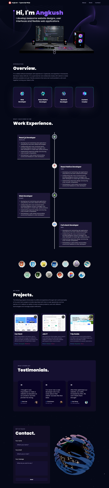

# 3-D Portfolio

A visually blessing 3d portfolio

### Visit :- [Portfolio](https://angkush-3d.netlify.app/)

## Tech Stack


Javascript - React - Three.js - CSS - Tailwind - Netlify

## Install

Download the zipped directory of this project by clicking on the green button above or clone it to your machine using the following command

```git
git clone https://github.com/angkushsahu/3d-portfolio.git
```

After installing the project, go to the root directory of this project and hit the commands below

```bash
npm i
```

## About the Developer

### Hey, this is Angkush

Contact Me from [here](https://angkush.vercel.app/contact)

<a href="https://angkush.vercel.app/" rel="noopener noreferrer" target="_blank">
  
</a>

<a href="https://linkedin.com/in/angkush-sahu-0409311bb" rel="noopener noreferrer" target="_blank">
  
</a>

<a href="https://angkush.vercel.app/contact" rel="noopener noreferrer" target="_blank">
  
</a>

<a href="https://github.com/angkushsahu" rel="noopener noreferrer" target="_blank">
  
</a>


